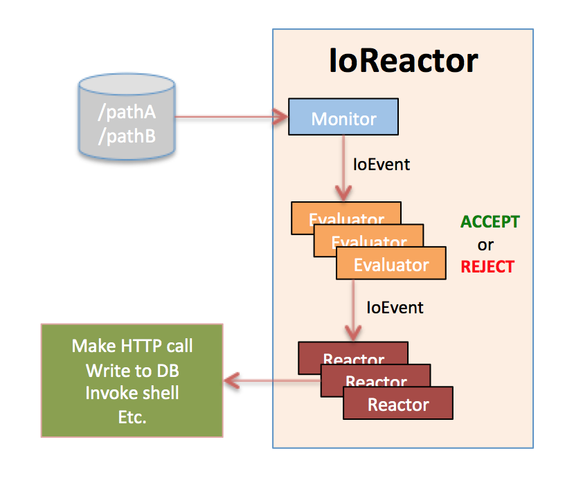
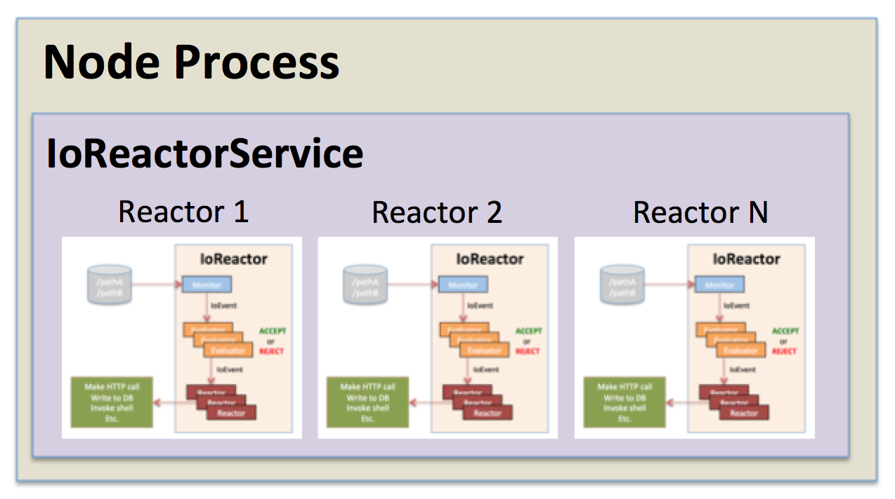

# io-event-reactor

Node.js module for reacting to filesystem events by invoking plugins that match configurable evaluators.

[](https://nodei.co/npm/io-event-reactor/)

* [How it works](#works)
* [Requirements](#requirements)
* [Install](#install)
* [Usage](#usage)
* [Plugins](#plugins)
* [Monitor Plugins](#monitors)
* [Reactor Plugins](#reactors)

## <a id="works"></a> How it works

The basic concept is this; you have a `monitor` that listens for IO events for particular paths
on the filesystem. As these IO events occur, they are passed on to one or more `evaluators` to
decide whether or not the `IoEvent` should be reacted to by one or more configured `reactors`.
The entire latter sequence is encapsulated in an `IoReactor` instance that manages the flow
between the three described components.

)

With this module, you construct and configure a single `IoReactorService` which can manage and contain
one or more `IoReactor` instances, as many as you wish, providing for lots of flexibility for reacting to filesystem events.

When you configure the `IoReactorService` and its `IoReactor` instances, you specify which plugins you would like
to use to fulfill the `monitor` and `reactor` roles. For `evaluators` you simply provide one or more functions
which evaluate whether or not an `IoEvent` should be passed on to one or more `reactors`.



### <a id="requirements"></a> Requirements

* [Node](https://nodejs.org/en/) 4.4.5+

### <a id="install"></a> Install

```
npm install io-event-reactor
```

### <a id="usage"></a> Usage

Usage is pretty straight forward, one of the better starting points to to review the [io-event-reactor-integration-tests](https://github.com/bitsofinfo/io-event-reactor-integration-tests) `sampleIoReactor.js`
project to see a working example and configuration.

Below is an end-to-end simple sample:

1. `mkdir myapp/`
2. `mkdir -p /tmp/myapp`
3. `npm install io-event-reactor`
4. `npm install io-event-reactor-plugin-chokidar`
5. `vi myapp.js`

```
var IoReactorService = require("io-event-reactor");
var EvaluatorUtil = require('io-event-reactor/ioReactor').EvaluatorUtil;

// IoReactorService configuration
var config = {
  ioReactors: [
        {   id: "reactor1",
            monitor: {
                plugin: "io-event-reactor-plugin-chokidar",
                config: {
                    paths: "/tmp/myapp",
                    options: {
                        alwaysStat: false,
                        awaitWriteFinish: {
                            stabilityThreshold: 200,
                            pollInterval: 100
                        },
                        ignoreInitial:true
                    }
                }
            },

            /**
            *
            * evaluators - REQUIRED array[] of one or more config objects, each containing the following properties
            *   - evaluator: function(ioEventType, fullPath, optionalFsStats, optionalExtraInfo), if function returns 'true' all attached reactors will be invoked. If false, nothing will happen. See the 'Evaluators' class for methods that will generate an applicable function for simple use-cases.
            *   - reactors: array[] of reactor ids that should be invoked if the 'evaluator' function returns 'true'
            */
            evaluators: [
                {
                    evaluator: EvaluatorUtil.regex(['add','change','unlink','unlinkDir','addDir'],'.*bitsofinfo.*','ig'),
                    reactors: ['code1']
                }
            ],

            reactors: [
                { id: "code1",
                  plugin: "./default_plugins/code/codeReactorPlugin",
                  config: {
                      codeFunction: function(ioEvent) {
                          return new Promise(function(resolve,reject){
                             console.log("I just reacted to an IoEvent! type: " +ioEvent.eventType + " file: " +ioEvent.fullPath);
                          });
                      }
                  }
                }
            ]
        }
   ]
};

// start the reactor
var reactor = new IoReactorService(config);
```

6. `node myapp.js`
7. In another shell: `touch /mtp/myapp/bitsofinfo.txt`
8. You should see output: `I just reacted to an IoEvent! type: add file: /tmp/myapp/bitsofinfo.txt`

For more info on configuration options see the JSDoc in [ioReactorService.js](https://github.com/bitsofinfo/io-event-reactor/blob/master/ioReactorService.js)
and [ioReactor.js](https://github.com/bitsofinfo/io-event-reactor/blob/master/ioReactor.js)

### <a id="plugins"></a> Plugin support

This module is extensible via plugin contracts for both `monitors` and `reactors`. You can pretty much customize it to
integrate it with anything you want. See [io-event-reactor-plugin-support](https://github.com/bitsofinfo/io-event-reactor-plugin-support)
for more details on creating plugins.

* [io-event-reactor-plugin-support](https://github.com/bitsofinfo/io-event-reactor-plugin-support) - Required module for developing any plugin

### <a id="monitors"></a> Monitor plugins
* [io-event-reactor-plugin-chokidar](https://github.com/bitsofinfo/io-event-reactor-plugin-chokidar) - Monitor the filesystem for changes using [Chokidar](https://github.com/paulmillr/chokidar)

### <a id="reactors"></a> Reactor plugins

 **Default Plugins**

The plugins below are simple and just come with this module by default.

* [code](default_plugins/code) - Permits arbitrary execution of javascript, to use: `./default_plugins/code/codeReactorPlugin`
* [logger](default_plugins/logger) - Log reactions to monitored events, to use: `./default_plugins/logger/loggerReactorPlugin`

**External module plugins**
* [io-event-reactor-plugin-shell-exec](https://github.com/bitsofinfo/io-event-reactor-plugin-shell-exec) - Exec shell commands via [stateful-process-command-proxy](https://github.com/bitsofinfo/stateful-process-command-proxy)
* [io-event-reactor-plugin-mysql](https://github.com/bitsofinfo/io-event-reactor-plugin-mysql) - Exec SQL against data in MySql via [node-mysql](https://github.com/felixge/node-mysql)


### Unit tests

To run the unit tests go to the root of the project and run the following.

```
mocha test/all.js
```
